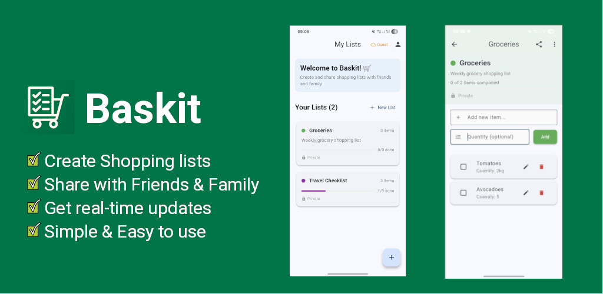

<div align="center">
  
  
  # Baskit 🛒
  
  A collaborative real-time shopping list app that allows users to create, share, and manage shopping lists together.
  
  
</div>

## 📱 Features

- **Guest-First Experience**: Start using the app immediately without registration
- **Create Multiple Lists**: Users can create and manage multiple shopping lists
- **Optional Authentication**: Sign in to sync lists across devices and collaborate
- **Real-time Collaboration**: Share lists with other users and collaborate in real-time (when signed in)
- **Live Updates**: Mark items as done and see changes instantly across all devices
- **Cross-platform**: Available on iOS, Android, Web, and Desktop (Flutter)
- **Offline Support**: Continue adding items even when offline, sync when back online
- **User Management**: Invite users via email or sharing links (when signed in)
- **List Categories**: Organize lists by categories (groceries, household, etc.)
- **Clear Completed Items**: Remove all completed items to reuse lists (perfect for recurring shopping lists)

## 🚀 Current Implementation Status

### ✅ Completed Features
- **Flutter App Structure**: Complete navigation system with go_router
- **Guest Experience**: App starts directly on lists page, no login required
- **Optional Authentication**: Login/register available but not mandatory
- **Firebase Backend**: Full Firebase integration with authentication and Firestore
- **Local-First Storage**: All lists (personal + shared) cached locally using SharedPreferences
- **Shared Lists Offline**: Shared lists automatically synced to local storage for offline access
- **Create Lists**: Full form validation, color selection, and preview
- **List Management**: View all created lists with real-time updates and offline fallback
- **List Detail View**: Full integration with local storage, real-time item management
- **Item Management**: Add, edit, delete items within lists with quantity support
- **Real-time Collaboration**: Share lists with other users with immediate local caching
- **UI/UX**: Modern Material Design 3 with light/dark theme support
- **Navigation**: Proper back navigation and routing between screens
- **Profile Management**: Guest mode with optional sign-in
- **Clear Completed Items**: Remove all completed items from lists to enable list reuse
- **Firebase Authentication**: Google, Email, and Anonymous auth with seamless guest conversion
- **Firebase Firestore**: Real-time database with offline support and automatic sync
- **Firebase Security Rules**: Secure data access and sharing permissions

### 🔄 Next: Storage Architecture Upgrade
- **Migrate to Hive**: Replace SharedPreferences with Hive for better local storage performance
- **Simplified Dual-Layer**: Clean separation between local (anonymous) and Firebase (authenticated) storage
- **Enhanced Offline Experience**: Instant UI responses with background sync for authenticated users

### 📋 Future Enhancements
- **Cloud Functions**: Server-side logic for invitations and notifications
- **Firebase Hosting**: Web app deployment with CDN
- **Push Notifications**: Real-time collaboration notifications
- **Advanced Sharing**: Role-based permissions and invitation management

## 🏗️ Architecture

### User Experience Flow (Local-First)
1. **Anonymous Auth (Default)**: Users automatically get Firebase anonymous auth
2. **Local-First Storage**: All lists (personal + shared) immediately cached locally
3. **Seamless Offline**: Full functionality including shared lists works offline
4. **Smart Sync**: Real-time Firebase sync with automatic local caching
5. **Optional Account Creation**: Convert anonymous user to full account with Google/Email
6. **Offline Collaboration**: Shared lists remain accessible even when offline

### Frontend (Flutter App)
```
app/
├── lib/
│   ├── main.dart
│   ├── models/
│   │   ├── shopping_list.dart ✅
│   │   ├── user.dart
│   │   ├── shopping_item.dart
│   │   └── list_member.dart
│   ├── services/
│   │   ├── firebase_auth_service.dart 🔄
│   │   ├── firestore_service.dart 🔄
│   │   ├── realtime_service.dart 🔄
│   │   └── storage_service.dart ✅ (local cache)
│   ├── providers/
│   │   ├── auth_provider.dart
│   │   ├── lists_provider.dart
│   │   └── theme_provider.dart
│   ├── screens/
│   │   ├── auth/ ✅ (optional)
│   │   ├── lists/ ✅ (default landing)
│   │   ├── list_detail/ ✅ (UI only)
│   │   └── profile/ ✅ (guest/user modes)
│   ├── widgets/
│   │   ├── common/
│   │   ├── list_widgets/
│   │   └── item_widgets/
│   └── utils/
│       ├── app_router.dart ✅
│       ├── constants.dart
│       ├── validators.dart
│       └── helpers.dart
```

### Backend Architecture 🔄 **REDESIGNED FOR FIREBASE**

#### Firebase Services
- **Firebase Authentication**: Anonymous, Google, and Email authentication
- **Firestore Database**: Real-time NoSQL database with offline support
- **Cloud Functions**: Server-side logic for complex operations
- **Firebase Storage**: File uploads and media storage
- **Firebase Hosting**: Static web app hosting with CDN
- **Firebase Security Rules**: Database and storage access control

#### Database Structure (Firestore)

**✅ UPDATED: Global Lists Collection with Sharing Support**

Our Firebase implementation now uses a global lists collection that supports real list sharing:

```
📁 Firestore Collections:

users/{userId}
├── 📄 Document Fields:
│   ├── profile: object
│   │   ├── email: string | null       // User email (null for anonymous)
│   │   ├── displayName: string | null // Display name
│   │   ├── photoURL: string | null    // Profile photo URL
│   │   ├── createdAt: timestamp       // Account creation time
│   │   └── isAnonymous: boolean       // Anonymous vs authenticated
│   ├── listIds: array<string>         // Array of owned list IDs (legacy)
│   └── sharedIds: array<string>       // Array of shared list IDs (legacy)

lists/{listId}                         // 🔥 GLOBAL COLLECTION - ENABLES SHARING
├── 📄 Document Fields:
│   ├── name: string                   // List name
│   ├── description: string            // List description
│   ├── color: string                  // Hex color code
│   ├── ownerId: string                // Owner's Firebase UID
│   ├── createdAt: timestamp           // Creation time
│   ├── updatedAt: timestamp           // Last modification
│   ├── memberIds: array<string>       // Array of member UIDs (for efficient querying)
│   └── members: object                // Detailed member information
│       └── {userId}: object           // Member details
│           ├── userId: string         // Member's UID
│           ├── role: string           // owner, member
│           ├── displayName: string    // Member's display name
│           ├── email: string          // Member's email
│           ├── joinedAt: timestamp    // When they joined
│           └── permissions: object    // Granular permissions
│               ├── read: boolean      // Can view list
│               ├── write: boolean     // Can add/edit items
│               ├── delete: boolean    // Can delete items
│               └── share: boolean     // Can invite others
└── 📁 Subcollections:
    └── items/{itemId}                 // Shopping items
        ├── name: string               // Item name
        ├── quantity: string | null    // Quantity (optional)
        ├── completed: boolean         // Completion status
        ├── createdAt: timestamp       // Creation time
        ├── updatedAt: timestamp       // Last update
        └── createdBy: string          // Creator's UID
```

#### Current Implementation Status

**✅ Implemented Features:**
- **User Authentication**: Anonymous auth with Google sign-in linking
- **Personal Lists**: Each user has their own `lists` subcollection
- **Real-time Sync**: Live updates using Firestore listeners
- **Offline Support**: Firestore offline persistence enabled
- **Item Management**: Full CRUD operations for shopping items
- **Basic Metadata**: List name, description, color, timestamps

**🔄 Simplified Structure Benefits:**
- **User-Centric**: All user data isolated under their UID
- **Real-time Updates**: Firestore listeners provide live sync
- **Offline-First**: Built-in offline persistence and sync
- **Anonymous Support**: Full functionality without registration
- **Account Linking**: Seamless upgrade from anonymous to Google auth

#### Cloud Functions (TypeScript)
- **onUserCreate**: Initialize user profile and migrate anonymous data
- **onListCreate**: Set up list permissions and sharing
- **onListShare**: Send invitation emails and manage permissions
- **sendInvitation**: Email invitations with secure links
- **processInvitation**: Handle invitation acceptance/rejection
- **cleanupExpiredInvitations**: Background cleanup of expired invitations

#### Security Rules Features
- **User-based Access**: Users can only access their own data
- **List Sharing**: Shared lists accessible to invited members only
- **Role-based Permissions**: Owner, Editor, Viewer roles with different capabilities
- **Anonymous Support**: Anonymous users get full functionality
- **Real-time Validation**: Server-side validation for all operations

## 🛠️ Storage Architecture Redesign (Next Phase)

The app is transitioning to a **dual-layer, offline-first** architecture for optimal performance:

### 🎯 New User Experience Flow
1. **Anonymous Users**: Create and manage lists instantly using fast local Hive storage
2. **Authenticated Users**: Get instant UI responses from local cache + background Firebase sync
3. **Seamless Sign-in**: Switch from local-only to Firebase-backed storage without migration complexity
4. **True Offline-First**: UI never waits for network - always reads/writes locally first

### 🔧 New Technical Architecture

#### **Dual Storage Layers**
- **Local Layer (Hive)**: Primary storage for anonymous users, instant UI responses
- **Firebase Layer**: Real-time sync and collaboration for authenticated users
- **Smart Routing**: StorageService facade automatically chooses the right layer

#### **Implementation Benefits**
- **Instant Performance**: Hive provides binary storage with reactive streams
- **No Migration Complexity**: Anonymous data discarded on sign-in (important data already in Firebase)
- **Simplified Code**: No complex sync logic - Firestore offline persistence handles authenticated users
- **Better UX**: Loading states eliminated - UI always shows data immediately

### 🔄 Migration Plan
1. **Add Hive Dependencies**: Replace SharedPreferences with structured binary storage
2. **Create Local Storage Service**: Hive-based CRUD with reactive streams  
3. **Refactor Storage Facade**: Clean separation between anonymous/authenticated flows
4. **Remove Legacy Code**: Eliminate SharedPreferences and migration complexity
5. **Enhanced UI**: Add sync status indicators for authenticated users

### Current Data Models

Our data models are designed for simplicity and Firebase integration:

```dart
// Shopping List Model (app/lib/models/shopping_list.dart)
class ShoppingList {
  final String id;                    // Firestore document ID
  final String name;                  // List name
  final String description;           // List description
  final String color;                 // Hex color code
  final DateTime createdAt;           // Creation timestamp
  final DateTime updatedAt;           // Last update timestamp
  final List<ShoppingItem> items;     // Shopping items
  final List<String> members;         // Member names/emails (simple strings)

  // Helper methods
  int get completedItemsCount => items.where((item) => item.isCompleted).length;
  int get totalItemsCount => items.length;
  double get completionProgress => 
      totalItemsCount == 0 ? 0.0 : completedItemsCount / totalItemsCount;
  bool get isShared => members.isNotEmpty;
  int get memberCount => members.length;

  // Serialization
  Map<String, dynamic> toJson() => {
    'id': id,
    'name': name,
    'description': description,
    'color': color,
    'createdAt': createdAt.toIso8601String(),
    'updatedAt': updatedAt.toIso8601String(),
    'items': items.map((item) => item.toJson()).toList(),
    'members': members,
  };

  factory ShoppingList.fromJson(Map<String, dynamic> json) => ShoppingList(
    id: json['id'],
    name: json['name'],
    description: json['description'],
    color: json['color'],
    createdAt: DateTime.parse(json['createdAt']),
    updatedAt: DateTime.parse(json['updatedAt']),
    items: (json['items'] as List<dynamic>?)
        ?.map((itemJson) => ShoppingItem.fromJson(itemJson))
        .toList() ?? [],
    members: (json['members'] as List<dynamic>?)
        ?.map((member) => member.toString())
        .toList() ?? [],
  );
}

// Shopping Item Model (app/lib/models/shopping_item.dart)
class ShoppingItem {
  final String id;                    // Firestore document ID
  final String name;                  // Item name
  final String? quantity;             // Quantity (optional string)
  final bool isCompleted;             // Completion status
  final DateTime createdAt;           // Creation timestamp
  final DateTime? completedAt;        // Completion timestamp

  // Serialization
  Map<String, dynamic> toJson() => {
    'id': id,
    'name': name,
    'quantity': quantity,
    'isCompleted': isCompleted,
    'createdAt': createdAt.toIso8601String(),
    'completedAt': completedAt?.toIso8601String(),
  };

  factory ShoppingItem.fromJson(Map<String, dynamic> json) => ShoppingItem(
    id: json['id'],
    name: json['name'],
    quantity: json['quantity'],
    isCompleted: json['isCompleted'] ?? false,
    createdAt: DateTime.parse(json['createdAt']),
    completedAt: json['completedAt'] != null 
        ? DateTime.parse(json['completedAt']) 
        : null,
  );
}
```

### New Service Architecture (Post-Hive Migration)

```dart
// Local Storage Service (app/lib/services/local_storage_service.dart) - Hive Layer
class LocalStorageService {
  // Fast binary storage with reactive streams
  Future<void> init();
  Future<void> upsertList(ShoppingList list);
  Future<void> deleteList(String id);
  Stream<List<ShoppingList>> watchAll();
  Stream<ShoppingList?> watchById(String id);
  // Item management methods...
}

// Firestore Layer (app/lib/services/firestore_layer.dart) - Firebase Wrapper
class FirestoreLayer {
  // Thin wrapper around Firestore with offline persistence
  Future<String?> createList(ShoppingList list);
  Stream<List<ShoppingList>> watchLists();
  Stream<ShoppingList?> watchById(String id);
  // Leverages built-in Firestore offline capabilities
}

// Storage Service (app/lib/services/storage_service.dart) - Smart Facade
class StorageService {
  final _local = LocalStorageService();
  final _firebase = FirestoreLayer();
  
  // Public API (unchanged for UI)
  Future<bool> createList(ShoppingList list);
  Stream<List<ShoppingList>> getListsStream();
  
  // Internal routing logic
  bool get _useLocal => FirebaseAuthService.isAnonymous;
  
  // Automatically routes to correct layer:
  // - Anonymous users → Hive (instant, local-only)
  // - Authenticated users → Firebase (with offline cache)
  
  // No migration needed - anonymous data discarded on sign-in
}

// Firebase Authentication (app/lib/services/firebase_auth_service.dart)
class FirebaseAuthService {
  // Anonymous authentication by default
  static Future<UserCredential?> signInAnonymously();
  
  // Google sign-in with automatic data cleanup
  static Future<UserCredential?> signInWithGoogle();
  
  // Sign out with automatic local data cleanup
  static Future<void> signOut();
  
  // Current user info
  static User? get currentUser;
  static bool get isAnonymous;
  static String get userDisplayName;
  static String? get userEmail;
}

// Firestore Service (app/lib/services/firestore_service.dart) - Firebase Operations
class FirestoreService {
  // List management (authenticated users only)
  static Future<String?> createList(ShoppingList list);
  static Stream<List<ShoppingList>> getUserLists();
  static Stream<ShoppingList?> getListById(String listId);
  static Future<bool> updateList(String listId, {String? name, String? description, String? color});
  static Future<bool> deleteList(String listId);
  
  // Item management
  static Future<String?> addItemToList(String listId, ShoppingItem item);
  static Future<bool> updateItemInList(String listId, String itemId, {String? name, String? quantity, bool? completed});
  static Future<bool> deleteItemFromList(String listId, String itemId);
  
  // Offline persistence automatically enabled
  static Future<void> enableOfflinePersistence();
}
```

### Key Implementation Details

**🔄 Current Approach:**
- **Simplified Models**: Focus on core functionality without over-engineering
- **User-Scoped Data**: Each user's lists are stored in their subcollection
- **Real-time Streams**: Firestore listeners for live updates
- **Anonymous-First**: App works immediately without sign-up
- **Google Linking**: Seamless upgrade from anonymous to Google account

**📊 Updated Query Patterns:**
```dart
// Get user's lists (both owned and shared) 🎉 NOW WORKS!
FirestoreService.getUserLists()
// Queries: lists.where('memberIds', arrayContains: currentUserId)

// Get specific list with items (checks access permissions)
FirestoreService.getListById(listId)

// Real-time updates for all accessible lists
FirestoreService.getUserLists().listen((lists) {
  // Includes both owned lists and lists shared with the user
});

// Share a list (now actually works!)
FirestoreService.shareListWithUser(listId, 'friend@example.com')
```

**🔧 Current Implementation Status:**

#### ✅ **Firebase Backend Complete**
- **Real-time Collaboration**: Live updates across devices using Firestore listeners
- **Global List Sharing**: Lists stored in global collection accessible to all members
- **Efficient Queries**: Use `memberIds` array for fast "where user is member" queries
- **Access Control**: Built-in permission checking with Firebase Security Rules
- **Offline Persistence**: Firebase handles caching and sync automatically

#### 🔄 **Next: Storage Performance Upgrade**
- **Hive Migration**: Replace SharedPreferences with fast binary storage
- **Dual-Layer Architecture**: Clean separation between local and Firebase layers
- **Zero Migration**: Simplified approach - discard anonymous data on sign-in
- **Instant UI**: Eliminate loading states with immediate local responses
- **Better Streams**: Reactive Hive streams for real-time local updates

#### 🎯 **Target Benefits**
- **Performance**: Binary storage significantly faster than JSON parsing
- **Simplicity**: No complex migration logic or data merging
- **User Experience**: Instant app startup and immediate data availability
- **Code Quality**: Cleaner separation of concerns between storage layers

## 🚀 Getting Started

### Frontend (Flutter App)

1. **Install Dependencies**
   ```bash
   cd app
   flutter pub get
   ```

2. **Configure Firebase**
   - Create a new Firebase project at [Firebase Console](https://console.firebase.google.com/)
   - Enable Authentication (Anonymous, Google, Email/Password)
   - Enable Firestore Database
   - Download `google-services.json` (Android) and `GoogleService-Info.plist` (iOS)
   - Place configuration files in respective platform directories

3. **Run the App**
   ```bash
   flutter run
   ```

4. **Start Using Immediately**
   - App automatically signs in anonymously
   - All data syncs to Firestore in real-time
   - Works offline with automatic sync when online
   - Optional: Convert to full account for cross-device sync

### Backend (Firebase Services)

1. **Firestore Setup**
   - Database rules configured for user-based access
   - Collections automatically created on first use
   - Offline persistence enabled by default

2. **Cloud Functions (Optional)**
   ```bash
   cd functions
   npm install
   firebase deploy --only functions
   ```

3. **Security Rules**
   ```bash
   firebase deploy --only firestore:rules
   firebase deploy --only storage:rules
   ```

4. **Web Hosting**
   ```bash
   flutter build web
   firebase deploy --only hosting
   ```

## 📚 Documentation

- **Firebase Setup**: Complete guide for setting up Firebase project and services
- **Security Rules**: Firestore and Storage security rules for data protection
- **Cloud Functions**: Server-side logic examples and deployment guide
- **Flutter Integration**: Examples for integrating with Firebase services

## 🔐 Authentication & Data Flow

1. **Anonymous Start**: Users automatically get Firebase anonymous authentication
2. **Real-time Sync**: All data immediately syncs to Firestore with offline support
3. **Account Conversion**: Seamlessly link anonymous account to Google/Email
4. **Cross-device Sync**: Data automatically syncs across all user devices
5. **Collaboration**: Share lists with real-time updates for all members
6. **Security**: Firestore security rules ensure users only access their own data

### Benefits of Firebase Approach

- **Real-time Database**: Firestore provides instant updates across devices
- **Offline First**: Built-in offline persistence with automatic sync
- **Scalability**: Firebase handles scaling automatically
- **Security**: Built-in authentication and security rules
- **Simplicity**: No custom backend code needed for basic operations
- **Cost Effective**: Pay-as-you-go pricing model
- **Analytics**: Built-in usage analytics and crash reporting

## 📄 License

This project is licensed under the MIT License - see the [LICENSE](LICENSE) file for details.

---

Made with ❤️ for better shopping experiences

## 🔐 Firebase Security Rules

To enable list sharing and proper permissions, you need to deploy the Firebase Security Rules:

### **Deploy Security Rules**

1. **Install Firebase CLI** (if not already installed):
   ```bash
   npm install -g firebase-tools
   ```

2. **Login to Firebase**:
   ```bash
   firebase login
   ```

3. **Initialize Firebase** (if not already done):
   ```bash
   firebase init firestore
   ```

4. **Deploy Security Rules**:
   ```bash
   firebase deploy --only firestore:rules
   ```

### **Security Rules Features**

The security rules enable:

- ✅ **List Owners**: Full permissions (create, read, write, delete, share)
- ✅ **List Members**: Full permissions except deleting the list itself
- ✅ **Shared Access**: Members can see and interact with shared lists
- ✅ **User Profiles**: Users can find each other by email for sharing
- ✅ **Anonymous Users**: Can access their own data and convert to full accounts

### **Permission Levels**

When sharing lists, members get these permissions:
- **Read**: ✅ Can view the list and items
- **Write**: ✅ Can add and edit items  
- **Share**: ✅ Can invite others to collaborate
- **Delete**: ✅ Can delete items and clear completed items

**Note**: Only the list owner can delete the entire list itself.

**📋 Important**: Deploy the security rules to fix the "only owner can add items" issue!
