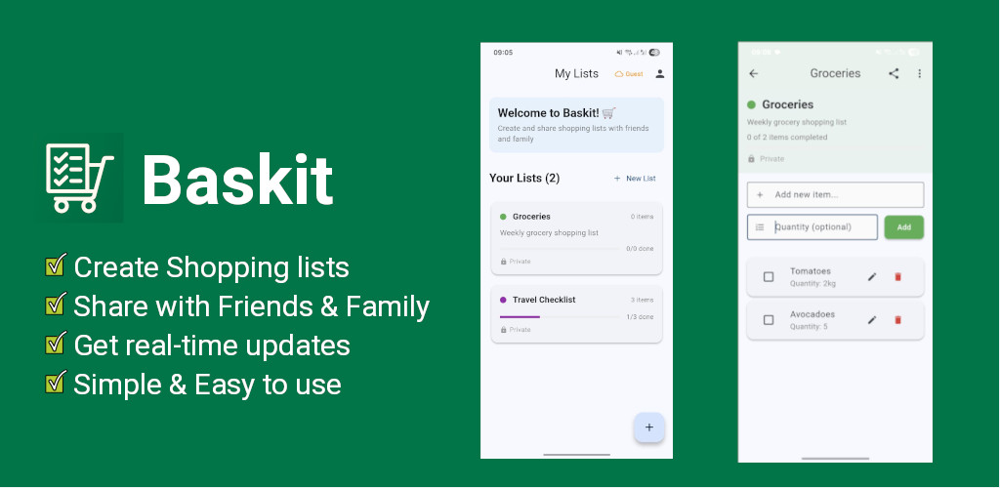

<div align="center">
  

  # Baskit 🛒

  **Baskit is a friendly shopping list app for quickly building lists, checking off items, and sharing them when you need help at the store.**

  
</div>

## Highlights

- Start instantly as a guest — no account required.
- Keep lists available offline with local storage.
- Sign in with Google when you want cloud sync or shared lists.
- Collaborate in real time with list members.
- Use a clean Material 3 interface with light and dark themes.
- Run on Flutter-supported mobile, web, and desktop targets.

## Run locally

### Prerequisites

- Flutter SDK `3.41.6` (see `.tool-versions`)
- Android Studio or Xcode for device builds
- A Firebase project if you want auth, sync, or sharing features

### Install

```bash
git clone https://github.com/kmjayadeep/baskit.git
cd baskit/app
flutter pub get
flutter run
```

### Firebase setup

The app can run in local-first guest mode, but Firebase-backed features need platform config files from your Firebase project:

- Android: `app/android/app/google-services.json`
- iOS/macOS: `GoogleService-Info.plist` in the appropriate platform runner

Keep these files out of source control unless they are intentionally public for your environment.

## Useful commands

Run commands from `app/` unless noted otherwise.

```bash
flutter analyze
flutter test
flutter build apk --release
```

## Contributing

Contributions are welcome. Please keep changes focused, follow the existing Flutter/Riverpod patterns, and run relevant checks before opening a pull request.

For deeper product and technical context, start with the [PRD index](prds/00-index.md) or browse the [PRDs](prds/).

## License

Baskit is available under the [MIT License](LICENSE).
