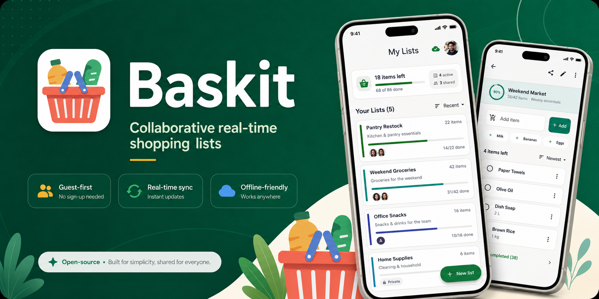

<div align="center">
  

  # Baskit 🛒

  **Shopping lists that work instantly as a guest, then sync and collaborate when you need them.**

  [](https://github.com/kmjayadeep/baskit/actions/workflows/build-apk.yml)
  [](https://github.com/kmjayadeep/baskit/actions/workflows/deploy-pages.yml)
  [](LICENSE)

  
</div>

## Why Baskit?

Baskit is a collaborative shopping list app for everyday grocery runs, shared households, and quick errands. It is designed around a **guest-first** promise: open the app, make a list, and start shopping without creating an account or depending on a network connection.

When sharing or cross-device sync becomes useful, sign in with Google and Baskit moves local lists into the cloud-backed experience. The same app supports quick solo use, household coordination, and release-ready Firebase-backed collaboration.

## What you can do

- **Start instantly as a guest** - create and manage shopping lists with no account gate.
- **Keep working offline** - guest lists are stored locally on the device with Hive.
- **Sign in when ready** - Google sign-in enables cloud sync and shared-list workflows.
- **Bring lists with you** - local guest data migrates to the signed-in account.
- **Collaborate on shopping** - invite members, leave shared lists, and keep everyone aligned.
- **Use a modern Flutter app** - Material 3 UI with light/dark themes across supported Flutter targets.

## Guest-first flow

1. Open Baskit and use it locally as a guest.
2. Add lists and items immediately, even before Firebase is configured.
3. Sign in only when you want sharing or cross-device sync.
4. Keep your data as local lists migrate into the authenticated account.

## Screenshots and assets

The README uses only checked-in repository assets:

- App icon: [`assets/icon.png`](assets/icon.png)
- Product cover image: [`assets/baskit-cover.png`](assets/baskit-cover.png)
- App launcher source icon: [`app/assets/icon/icon.png`](app/assets/icon/icon.png)

Add new README screenshots only when they are committed to the repository and referenced with relative paths.

## Project structure

```text
.
├── app/                    # Flutter app source, tests, and platform projects
│   ├── lib/models/         # Shopping list models and checked-in Hive adapters
│   ├── lib/services/       # Storage, Firebase, auth, and platform services
│   ├── lib/repositories/   # Data access abstractions
│   ├── lib/providers/      # Riverpod provider definitions
│   ├── lib/view_models/    # Riverpod Notifier-based app state
│   ├── lib/screens/        # Feature screens and screen view models
│   ├── lib/widgets/        # Reusable UI components
│   ├── lib/utils/          # Routing and helpers
│   └── test/               # Unit and widget tests
├── assets/                 # README imagery and shared project assets
├── docs/                   # Operational documentation
├── pages/                  # Static website, privacy, account deletion, and docs pages
├── scripts/                # Release and automation helpers
└── AGENTS.md               # Contributor and agent workflow guide
```

Generated Hive adapters live under `app/lib/**.g.dart`; do not edit them manually.

## Technology overview

- **Flutter/Dart** for the app shell and cross-platform UI.
- **Riverpod 3 Notifier providers** for app state and feature view models.
- **Hive** for local guest storage and offline-first behavior.
- **Firebase Authentication** for Google sign-in.
- **Cloud Firestore** for synced and shared shopping lists.
- **Firebase Crashlytics** for release diagnostics where configured.
- **GoRouter** for app navigation.

The app keeps UI widgets focused on presentation, routes storage through services/repositories, and preserves the local-first guest experience even when Firebase configuration is unavailable.

## Prerequisites

- Flutter SDK `3.41.6` (matches CI and [.tool-versions](.tool-versions)).
- Dart SDK bundled with that Flutter release.
- Android Studio and/or Xcode for mobile builds.
- Optional: a Firebase project for Google sign-in, Firestore sync, sharing, and Crashlytics.
- Optional: [`mise`](https://mise.jdx.dev/) to use the pinned toolchain consistently with local automation.

## Run locally

```bash
git clone https://github.com/kmjayadeep/baskit.git
cd baskit/app
flutter pub get
flutter run
```

If you use `mise`, run commands through the pinned toolchain:

```bash
cd app
mise exec -- flutter pub get
mise exec -- flutter run
```

Baskit can run in guest mode without Firebase setup. Firebase-backed flows require platform-specific config files before those features are exercised.

## Optional Firebase setup

Create a Firebase project and enable the products used by your target platform:

1. Enable Google sign-in in Firebase Authentication.
2. Create a Cloud Firestore database and apply the project rules for shared-list access.
3. Register each app platform you plan to run.
4. Add local config files for your environment:
   - Android: `app/android/app/google-services.json`
   - iOS/macOS: `GoogleService-Info.plist` in the appropriate platform runner directory
   - Web: generated Firebase options/config for your web app setup, if applicable
5. Keep private Firebase config and signing files out of source control unless they are intentionally public for the environment.

## Development commands

Run Flutter commands from `app/`:

```bash
flutter --version      # confirm the expected Flutter version
flutter pub get        # install dependencies
flutter analyze        # static analysis
flutter test           # unit and widget tests
flutter run            # launch the app
```

Common build commands:

```bash
flutter build apk --release
flutter build appbundle --release
flutter build ios --release
flutter build web --release
```

Code generation, when model adapters need to be regenerated:

```bash
flutter pub run build_runner build --delete-conflicting-outputs
```

## Testing and release workflow

Before opening a pull request, run the checks relevant to your change:

```bash
cd app
flutter analyze
flutter test
```

For UI or web-facing changes, also run:

```bash
flutter build web
```

Release automation is documented in [`docs/play-release-automation.md`](docs/play-release-automation.md). Use CI snapshot artifacts for frequent maintainer smoke testing. Use `./scripts/release.sh` only for internal release candidates that may be promoted beyond Play internal testing; tagged candidates build signed artifacts, create a prerelease GitHub Release, export cumulative Play notes from `docs/release-promotion-state.json`, and upload the AAB to the Play internal track when secrets are configured.

## Troubleshooting

- **Flutter version mismatch:** use the version in [.tool-versions](.tool-versions), or run with `mise exec --`.
- **Dependency issues:** run `flutter clean` and `flutter pub get` from `app/`.
- **Firebase initialization errors:** confirm local platform config files exist and match the Firebase project/package identifiers.
- **Google sign-in fails locally:** verify OAuth clients, SHA fingerprints for Android, and bundle IDs for Apple platforms.
- **Generated file drift:** regenerate with `build_runner`; do not hand-edit `*.g.dart` files.
- **Release build signing failures:** confirm required CI secrets and local signing configuration are present for the target platform.

## Contributing

Contributions are welcome. Please keep changes focused and easy to review.

1. Read [AGENTS.md](AGENTS.md) for repository conventions, validation expectations, and code style.
2. Create a short-lived branch for a focused issue or improvement.
3. Keep business logic in services, repositories, or view models rather than widgets.
4. Preserve guest-first/local-first behavior when touching storage, auth, or sync flows.
5. Update this README or relevant supporting documentation when setup, architecture, release, or user-visible behavior changes.
6. Run validation before opening a pull request and include screenshots or recordings for UI changes.

## Roadmap themes

Current product direction centers on:

- Making the guest-to-signed-in transition feel seamless and trustworthy.
- Improving shared-list collaboration for households and recurring shopping trips.
- Keeping setup, testing, and release automation predictable for contributors and reviewers.
- Maintaining a simple, accessible shopping experience across supported Flutter targets.

## Security and privacy

Guest data is stored locally on the device. Cloud sync and list sharing require sign-in and use Firebase Authentication plus Firestore security rules to isolate user and shared-list data.

Please do not commit private Firebase configuration, signing keys, service account credentials, or production secrets. Use GitHub Actions secrets and local ignored files for sensitive configuration.

For account and data handling information, see the static site pages in [`pages/`](pages/), including privacy policy and account deletion content.

## License

Baskit is licensed under the [MIT License](LICENSE).

---

Made with ❤️ for calmer shopping trips.
