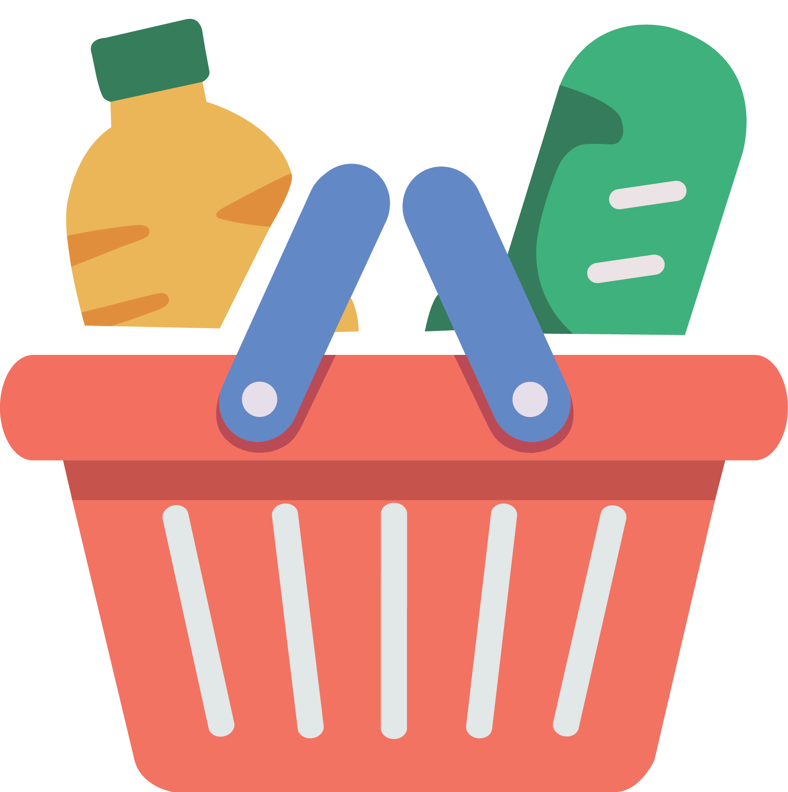

<div align="center">
  
  
  # Baskit 🛒
  
  A collaborative real-time shopping list app that allows users to create, share, and manage shopping lists together.
  
  
</div>

## 🚀 Quick Start

### Prerequisites
- Flutter SDK (3.0+)
- Firebase project (for backend services)
- Android Studio / Xcode for mobile development

### Installation
```bash
# Clone and setup
git clone <repository-url>
cd baskit/app
flutter pub get

# Configure Firebase (see setup guide)
# Add google-services.json (Android)
# Add GoogleService-Info.plist (iOS)

# Run the app
flutter run
```

## 📱 Features

### Guest-First Experience
- **Zero Sign-Up Friction**: Start using the app immediately, no account required
- **Full Offline Functionality**: All features available without internet
- **Local-First for Guests**: Lightning-fast Hive storage on your device
- **Privacy by Default**: Guest data stays on your device

### Collaboration & Sync
- **Optional Cloud Upgrade**: Sign in with Google when you need sync or sharing
- **Automatic Data Migration**: Seamless transition from guest to authenticated user
- **Real-time Collaboration**: Share lists and see updates instantly
- **Cross-Device Sync**: Access your lists from anywhere (authenticated users)

### Technical
- **Cross-platform**: iOS, Android, Web, and Desktop
- **Modern UI**: Material Design 3 with dark/light themes
- **Smart Storage**: Hive for guests, Firebase for authenticated users
- **Granular Permissions**: Fine-grained control over list sharing

## 🏗️ Guest-First Architecture

### Core Design Principles

**Zero-Friction Onboarding**: Users can start using the app immediately without creating an account. This "guest-first" approach removes all barriers to entry while providing a seamless upgrade path when users need cloud features.

**Progressive Enhancement**: 
1. **Guest Mode (Default)**: Automatic anonymous authentication, all data stored locally in Hive
2. **Sign In When Needed**: Users upgrade to Google account when they want sharing or sync
3. **Automatic Migration**: Local data seamlessly transfers to Firebase on sign-in
4. **No Data Loss**: Complete preservation of all lists and items during upgrade

**Smart Storage Routing**:
- **Anonymous Users → Hive**: Fast local binary storage, instant operations, complete offline support
- **Authenticated Users → Firebase**: Real-time sync, cross-device access, collaboration features
- **Transparent Switching**: `StorageService` automatically routes based on authentication state

### Tech Stack
- **Frontend**: Flutter 3.16+ (Dart 3.7.2+)
- **State Management**: Riverpod 3.x with modern Notifier API
- **Local Storage**: Hive 2.x for binary storage with type adapters
- **Backend**: Firebase (Auth, Firestore)
- **Authentication**: Anonymous by default, optional Google Sign-In
- **Navigation**: GoRouter 16.x

### Storage Architecture
- **Anonymous Users**: All data stored locally in Hive (fast, offline-first)
- **Authenticated Users**: Data stored in Firestore with offline persistence
- **Account Conversion**: Automatic migration from local to cloud on sign-in
- **Sharing**: Real-time collaborative lists via Firestore (authenticated users only)

## 📚 Documentation

### Setup Guides
- **[Firebase Setup](docs/firebase-setup.md)** - Complete Firebase configuration
- **[Authentication](docs/authentication.md)** - Google Auth and anonymous login
- **[Development Guide](docs/development-guide.md)** - Local setup, testing, and deployment

### Architecture & Design
- **[Database Architecture](docs/database-architecture.md)** - Guest-first dual-layer storage, Firestore structure, and security rules
- **[Riverpod Architecture](docs/riverpod-architecture.md)** - State management patterns and provider structure
- **[UI & Assets](docs/ui-assets.md)** - Branding and asset management

## 🚀 Current Status

### ✅ Completed
- Complete Flutter app with Firebase backend
- Anonymous authentication with optional Google sign-in
- Real-time collaborative shopping lists with member management
- Dual-layer storage (Hive for local, Firestore for cloud)
- Automatic data migration on account conversion
- Contact suggestions for easy list sharing
- Granular permissions system (read, write, delete, share)
- Material Design 3 UI with dark/light themes
- Riverpod 3.x state management with centralized auth
- Cross-platform support (iOS, Android, Web, Desktop)

### 🔄 Future Enhancements
- Push notifications for real-time collaboration updates
- Advanced list templates and categories
- Shopping history and analytics
- Barcode scanning for quick item addition
- Recipe integration and meal planning
- Offline-first optimizations with smarter caching

## 🛠️ Development

### Quick Commands
```bash
# Development
flutter run
flutter test
flutter analyze

# Build
flutter build apk --release      # Android
flutter build ios --release      # iOS  
flutter build web --release      # Web
```

### Project Structure
```
app/
├── lib/
│   ├── models/                # Data models with Hive type adapters
│   │   ├── shopping_list_model.dart
│   │   ├── shopping_item_model.dart
│   │   ├── list_member_model.dart
│   │   └── *.g.dart           # Generated Hive adapters
│   ├── services/              # Core services
│   │   ├── firebase_auth_service.dart
│   │   ├── firestore_service.dart
│   │   ├── firestore_layer.dart
│   │   ├── local_storage_service.dart
│   │   ├── storage_service.dart
│   │   └── contact_suggestions_service.dart
│   ├── repositories/          # Repository pattern for data access
│   │   ├── shopping_repository.dart
│   │   └── storage_shopping_repository.dart
│   ├── providers/             # Riverpod provider definitions
│   ├── view_models/           # Riverpod ViewModels (Notifier classes)
│   ├── screens/               # UI screens with feature-specific ViewModels
│   │   ├── lists/
│   │   ├── list_detail/
│   │   └── profile/
│   ├── widgets/               # Reusable UI components
│   └── utils/                 # Routing and utilities
├── test/                      # Unit, widget, and integration tests
└── integration_test/          # End-to-end tests
```

## 🔐 Security & Privacy

- **Firebase Security Rules**: Server-side data access control
- **Anonymous Privacy**: No personal data collection for guest users
- **Secure Authentication**: Google OAuth and Firebase Auth
- **Data Isolation**: Users can only access their own data and shared lists

## 📄 License

This project is licensed under the MIT License - see the [LICENSE](LICENSE) file for details.

---

**Made with ❤️ for better shopping experiences**

> 📖 **Need help?** Check the [docs/](docs/) folder for detailed setup guides and architecture information.
