# Baskit App - Riverpod State Architecture

## Complete State Flow Diagram

```mermaid
graph TB
    %% Core Services Layer
    subgraph "🔧 Core Services"
        FirebaseAuth[Firebase Auth Service]
        FirestoreService[Firestore Service] 
        StorageService[Storage Service]
        ContactSuggService[Contact Suggestions Service]
    end

    %% Repository Layer
    subgraph "📚 Repository Layer"
        RepoProvider[shoppingRepositoryProvider<br/>Provider&lt;ShoppingRepository&gt;]
        StorageRepo[StorageShoppingRepository]
    end

    %% Global ViewModels Layer
    subgraph "🎯 Global ViewModels"
        subgraph "🔐 Authentication"
            AuthViewModel[AuthViewModel<br/>Notifier&lt;AuthState&gt;]
            AuthProvider[authViewModelProvider<br/>NotifierProvider]
            AuthUser[authUserProvider]
            IsAnon[isAnonymousProvider]
            IsAuth[isAuthenticatedProvider]
            IsGoogle[isGoogleUserProvider]
        end

        subgraph "👥 Contact Suggestions"
            ContactVM[ContactSuggestionsViewModel<br/>Notifier&lt;ContactSuggestionsState&gt;]
            ContactProvider[contactSuggestionsViewModelProvider<br/>NotifierProvider]
            ContactList[contactSuggestionsProvider]
            ContactLoading[contactSuggestionsLoadingProvider]
        end
    end

    %% Feature ViewModels Layer  
    subgraph "📱 Feature ViewModels"
        subgraph "📋 Lists Feature"
            ListsVM[ListsViewModel<br/>Notifier&lt;ListsState&gt;]
            ListsProvider[listsViewModelProvider<br/>NotifierProvider]
            
            ListFormVM[ListFormViewModel<br/>Notifier&lt;ListFormState&gt;]
            ListFormProvider[listFormViewModelProvider<br/>NotifierProvider]
        end

        subgraph "📝 List Detail Feature"
            ListDetailVM[ListDetailViewModel<br/>Notifier&lt;ListDetailState&gt;]
            ListDetailProvider[listDetailViewModelProvider<br/>NotifierProvider]
        end

        subgraph "👤 Profile Feature"
            ProfileVM[ProfileViewModel<br/>Notifier&lt;ProfileState&gt;]
            ProfileProvider[profileViewModelProvider<br/>NotifierProvider]
        end
    end

    %% Screens Layer
    subgraph "🖥️ Screens & UI"
        subgraph "📋 Lists Screen"
            ListsScreen[ListsScreen<br/>ConsumerWidget]
            ListFormScreen[ListFormScreen<br/>ConsumerStatefulWidget]
        end

        subgraph "📝 List Detail Screen"
            ListDetailScreen[ListDetailScreen<br/>ConsumerStatefulWidget] 
            ShareDialog[EnhancedShareListDialog<br/>ConsumerStatefulWidget]
        end

        subgraph "👤 Profile Screen"
            ProfileScreen[ProfileScreen<br/>ConsumerWidget]
        end
    end

    %% Dependencies - Services to Repositories
    StorageService -.-> StorageRepo
    FirestoreService -.-> StorageRepo
    FirebaseAuth -.-> StorageRepo
    StorageRepo --> RepoProvider

    %% Dependencies - Services to ViewModels
    FirebaseAuth -.-> AuthViewModel
    FirestoreService -.-> AuthViewModel
    ContactSuggService -.-> ContactVM
    
    %% Global Providers
    AuthViewModel --> AuthProvider
    AuthProvider --> AuthUser
    AuthProvider --> IsAnon
    AuthProvider --> IsAuth  
    AuthProvider --> IsGoogle

    ContactVM --> ContactProvider
    ContactProvider --> ContactList
    ContactProvider --> ContactLoading

    %% Feature ViewModels Dependencies
    RepoProvider -.-> ListsVM
    AuthUser -.-> ListsVM
    ListsVM --> ListsProvider

    RepoProvider -.-> ListFormVM
    AuthUser -.-> ListFormVM  
    ListFormVM --> ListFormProvider

    RepoProvider -.-> ListDetailVM
    AuthUser -.-> ListDetailVM
    ListDetailVM --> ListDetailProvider

    AuthUser -.-> ProfileVM
    ProfileVM --> ProfileProvider

    %% Auth Changes Listener (Key Integration!)
    AuthUser -.-> ContactVM
    ContactVM -.->|"Clear cache & reinitialize on auth change"| ContactSuggService

    %% Screen Dependencies
    ListsProvider -.-> ListsScreen
    IsAnon -.-> ListsScreen
    IsAuth -.-> ListsScreen

    ListFormProvider -.-> ListFormScreen
    AuthUser -.-> ListFormScreen

    ListDetailProvider -.-> ListDetailScreen
    AuthUser -.-> ListDetailScreen

    ContactProvider -.-> ShareDialog
    ContactList -.-> ShareDialog
    ContactLoading -.-> ShareDialog

    AuthProvider -.-> ProfileScreen
    ProfileProvider -.-> ProfileScreen

    %% Special Relationships
    ListsScreen -.->|Navigate to| ListDetailScreen
    ListDetailScreen -.->|Opens| ShareDialog
    ProfileScreen -.->|Navigate to| ListFormScreen

    %% Styling
    classDef service fill:#e1f5fe,stroke:#01579b,stroke-width:2px
    classDef repository fill:#f3e5f5,stroke:#4a148c,stroke-width:2px
    classDef viewmodel fill:#fff3e0,stroke:#e65100,stroke-width:2px
    classDef provider fill:#e8f5e8,stroke:#2e7d32,stroke-width:2px
    classDef screen fill:#fce4ec,stroke:#880e4f,stroke-width:2px

    class FirebaseAuth,FirestoreService,StorageService,ContactSuggService service
    class RepoProvider,StorageRepo repository
    class AuthViewModel,ContactVM,ListsVM,ListFormVM,ListDetailVM,ProfileVM viewmodel
    class AuthProvider,ContactProvider,ListsProvider,ListFormProvider,ListDetailProvider,ProfileProvider,AuthUser,IsAnon,IsAuth,IsGoogle,ContactList,ContactLoading provider
    class ListsScreen,ListFormScreen,ListDetailScreen,ShareDialog,ProfileScreen screen
```



## Key Architecture Patterns

### 1. **Layered Architecture**
- **Services Layer**: Direct Firebase/storage access
- **Repository Layer**: Abstract data access with `StorageShoppingRepository` 
- **ViewModel Layer**: Business logic + UI state management
- **UI Layer**: Screens and widgets that consume providers

### 2. **Global vs Feature Providers**
- **Global**: `AuthViewModel`, `ContactSuggestionsViewModel` (used across features)
- **Feature**: `ListsViewModel`, `ListDetailViewModel`, etc. (feature-specific)

### 3. **Provider Patterns Used**

> **Note**: The app uses **Riverpod 3.x** with the modern `Notifier` and `NotifierProvider` API (not the legacy `StateNotifier` API).

#### NotifierProvider (For Mutable State)
```dart
// Modern Riverpod 3.x pattern using Notifier class
class AuthViewModel extends Notifier<AuthState> {
  @override
  AuthState build() {
    // Initialize and return initial state
    final initialState = AuthState.fromAuthService();
    _initializeAuthStream();
    return initialState;
  }
}

final authViewModelProvider = NotifierProvider<AuthViewModel, AuthState>(
  AuthViewModel.new,
);

// Contact suggestions with auth integration
class ContactSuggestionsViewModel extends Notifier<ContactSuggestionsState> {
  @override
  ContactSuggestionsState build() {
    // 🔥 Key Pattern: Listen to auth changes using ref.listen
    ref.listen<String?>(authUserProvider.select((user) => user?.uid), (previous, next) {
      if (previous != next) {
        ContactSuggestionsService.clearCache();
        initializeContactsStream();
      }
    });
    
    initializeContactsStream();
    return const ContactSuggestionsState.loading();
  }
}

final contactSuggestionsViewModelProvider = 
  NotifierProvider<ContactSuggestionsViewModel, ContactSuggestionsState>(
    ContactSuggestionsViewModel.new,
  );
```

#### Provider (For Computed/Derived State)
```dart
final authUserProvider = Provider<User?>((ref) {
  return ref.watch(authViewModelProvider).user;
});

final contactSuggestionsProvider = Provider<List<ContactSuggestion>>((ref) {
  return ref.watch(contactSuggestionsViewModelProvider).contacts;
});
```

### 4. **Cross-ViewModel Communication**

#### Authentication → Contact Suggestions
- `ContactSuggestionsViewModel` listens to `authUserProvider` changes
- When user auth changes → Clear cache + reinitialize contacts stream
- Ensures proper separation of concerns (no tight coupling)

#### Repository Sharing
- All feature ViewModels depend on `shoppingRepositoryProvider`
- Centralized data access through single repository interface

### 5. **Screen Integration Patterns**

#### ConsumerWidget (Stateless)
```dart
class ListsScreen extends ConsumerWidget {
  @override
  Widget build(BuildContext context, WidgetRef ref) {
    final listsState = ref.watch(listsViewModelProvider);
    final isAnonymous = ref.watch(isAnonymousProvider);
    // ...
  }
}
```

#### ConsumerStatefulWidget (Stateful) 
```dart
class EnhancedShareListDialog extends ConsumerStatefulWidget {
  @override
  ConsumerState<EnhancedShareListDialog> createState() => _EnhancedShareListDialogState();
}

class _EnhancedShareListDialogState extends ConsumerState<EnhancedShareListDialog> {
  @override
  Widget build(BuildContext context) {
    final contactSuggestions = ref.watch(contactSuggestionsProvider);
    final isLoading = ref.watch(contactSuggestionsLoadingProvider);
    // ...
  }
}
```

## Contact Suggestions Integration 🎯

The recently implemented **Contact Suggestions** feature demonstrates advanced Riverpod patterns:

1. **Reactive Auth Integration**: Automatically clears cache when user changes
2. **Lazy Loading**: Only initializes when dialog is opened
3. **Error Handling**: Graceful fallback when Firebase permissions fail
4. **Caching**: Smart in-memory caching with user-specific invalidation
5. **Separation of Concerns**: Service handles business logic, ViewModel handles UI state

## State Flow Examples

### 1. User Authentication Flow
```
User signs in → AuthViewModel updates → authUserProvider emits change → 
ContactSuggestionsViewModel hears change → Clears cache → Reinitializes stream → 
UI gets fresh contact suggestions
```

### 2. List Creation → Sharing Flow  
```
User creates list → ListDetailViewModel updates → User opens share dialog → 
EnhancedShareListDialog renders → Watches contactSuggestionsProvider → 
ContactSuggestionsViewModel fetches from service → Service queries repository →
Repository queries Firestore → Contacts flow back through the chain
```

### 3. Cross-Feature Navigation
```
ListsScreen → Navigate to → ListDetailScreen → Open → EnhancedShareListDialog
Each screen maintains its own state while sharing global auth/repository providers
```

## Benefits of This Architecture

✅ **Separation of Concerns**: Each layer has a single responsibility  
✅ **Reactive Updates**: Changes propagate automatically through provider graph  
✅ **Testability**: Each ViewModel can be tested in isolation  
✅ **Performance**: Riverpod's fine-grained reactivity prevents unnecessary rebuilds  
✅ **Maintainability**: Clear dependency graph makes changes predictable  
✅ **Scalability**: Easy to add new features following established patterns  

